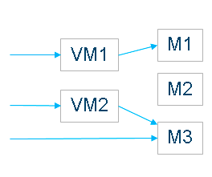

# VModels Reference

Regular models in model-mesh are assumed/required to be immutable. VModels add a layer of indirection in front of the immutable models. A vmodel is an alias mapping to a specific concrete model, which can be changed via the model management APIs. Runtime clients (making inferencing requests) can then specify a vmodel id instead of a model id, and these will automatically be served by the concrete model associated with that vmodel at the time the request is made.

The primary use case is for evolving a particular application model over time, so consumers of it automatically benefit from improved versions. For example:

1. You train and add a spanish model with id `es_1`, and add a vmodel with id es pointing to model `es_1`
2. Later, you train a new spanish model naming it `es_2`, and then set the target of the es model to `es_2`
3. "Users" would just send requests to es and automatically be served latest version

By default, when updating the target of a vmodel to a new concrete model, model-mesh will manage the transition to prevent any service degredation to end users. Specifically, the existing active model will continue to be served until the target model is "ready" - meaning it has successfully completed loading and is scaled out to the same degree as the existing active model.

No changes are required to model runtime implementations to start using vmodels. They continue to work with concrete "immutable" models in the same way and do not need to be aware of vmodels or the indirection taking place.

The keyspaces for models and vmodels are independent, and so for example while not recommended, there is nothing stopping you creating a model and vmodel with the same id.

## Usage

There are two main approaches for working with vmodels from a management point of view:

1. Add and delete (register/unregister) underlying models independently of vmodels, using the existing model management APIs
   - When creating or updating a vmodel, the target model is already assumed to exist
   - When a concrete model is no longer required/used by a vmodel, it remains registered and usable (when addressed directly), and must be deleted explicitly if/when desired
   - Attempting to delete a concrete model which is still referenced by one or more vmodels will fail
   - When calling `setVModel`, do not provide `modelInfo` and do not set `autoDeleteTargetModel` to `true`
2. Add/delete concrete models in concert with vmodels - this is the simpler and recommended approach.
   - To add and move to a new (concrete) version of a vmodel, use the `setVModel` API, providing `modelInfo` (which would otherwise have been passed to `registerModel`) and setting `autoDeleteTargetModel` to true
   - Concrete models added in this manner will be automatically deleted once no longer referenced by the vmodel (i.e. once it has completed transition to a newer concrete model or been deleted itself)
   - The `getModelStatus` rpc can be used to determine when concrete models have been deleted from model-mesh (must return `NOT_FOUND` status), i.e. to know when it is safe to remove the backing data

To send an inference request to a vmodel rather than a concrete model from runtime clients, just set the `mm-vmodel-id` gRPC metadata header instead of `mm-model-id`.

## VModel Management API 

See additions to the ModelMesh protobuf service interface [here](https://github.com/kserve/modelmesh/blob/main/src/main/proto/current/model-mesh.proto#L42).

`setVModel()` - add a vmodel or set the target model of an existing vmodel
- `SetVModelRequest`
  - `string vModelId`
  - `string targetModelId` - id of the target "concrete" model
  - `boolean updateOnly` - whether to require that the vmodel already exists
  - `ModelInfo modelInfo` - if provided, the target model will be added (see registerModel rpc), otherwise it must already exist
  - `boolean autoDeleteTargetModel` - if true, the created target model will be automatically deleted when no longer referenced. Applies only if modelInfo is provided
  - `boolean loadNow` - whether the new target model should be loaded immediately, even if the current active model isn't loaded (otherwise the target model will be loaded to the same scale as the current active model before it becomes the active model)
  - `boolean force` - if true, the active model will be updated immediately, regardless of the relative states of the target and currently-active models
  - `boolean sync` - whether this rpc invocation should block until the transition completes. If the vmodel didn't already exist and and loadNow is set to true, this will cause the method to block until the target of the newly created vmodel has completed loading
  - returns `VModelStatusInfo`
- `getVModelStatus()` - check the existence and status of a vmodel
  - `GetVModelStatus`
    - `string vModelId`
    - returns `VModelStatusInfo`
- `deleteVModel()` - to delete a vmodel 
    - `DeleteVModelRequest`
    - `string vModelId`